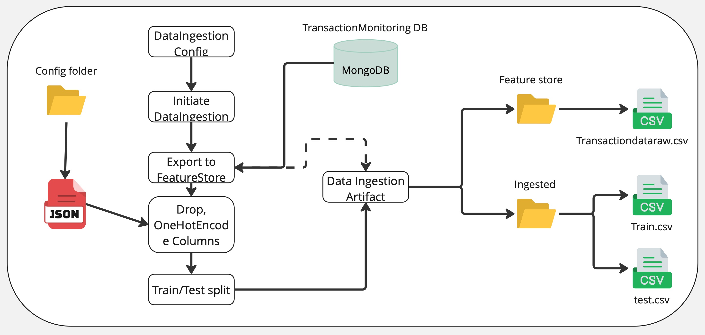
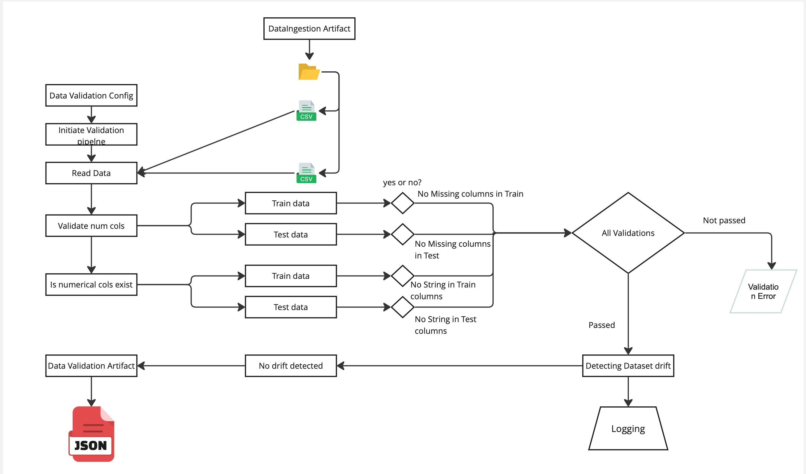

# 🚨 Problem Statement & Dataset Description 🚨

[Click here to view the full PDF](Assets/Mlops_struc.pdf)

Money laundering remains a major global issue, creating a pressing need for better transaction monitoring solutions. Current anti-money laundering (AML) systems are often ineffective, and access to relevant data is restricted due to legal and privacy concerns. Additionally, available datasets typically lack diversity and true labels. This study introduces a new solution: a **novel AML transaction generator** designed to create the **SAML-D dataset**, offering improved features and typologies. The aim is to support researchers in evaluating their models and developing advanced transaction monitoring techniques. 🔍

The **SAML-D dataset** consists of **12 features** and **28 typologies** (split between 11 normal and 17 suspicious), carefully curated based on existing datasets, academic research, and insights from AML experts. The dataset includes **9,504,852 transactions**, of which only **0.1039%** are flagged as suspicious. Additionally, **15 graphical network structures** are included to visualize the flow of transactions within these typologies. While some of these structures overlap across typologies, they vary in key parameters to increase the complexity and challenge of detecting suspicious behavior. For more details on these typologies, please refer to the paper linked above. This dataset is an updated version compared to the original paper. 📊

## 🧑‍💼 **Features of the SAML-D Dataset**:

- **Time & Date ⏰**: Crucial for tracking the chronological sequence of transactions.
  
- **Sender & Receiver Account Details 💳**: Helps uncover behavioral patterns and complex banking connections.

- **Amount 💰**: Represents transaction values, aiding in the identification of potentially suspicious activity.

- **Payment Type 💳📝**: Covers various payment methods such as credit card, debit card, cash, ACH transfers, cross-border, and checks.

- **Sender & Receiver Bank Location 🌍**: Highlights high-risk regions like Mexico, Turkey, Morocco, and the UAE.

- **Payment & Receiver Currency 💱**: Adds complexity when mismatched with location, enhancing analysis.

- **‘Is Suspicious’ Feature 🚨**: A binary flag that differentiates normal transactions from suspicious ones.

- **Type 📊**: Categorizes typologies, offering deeper insights into transaction patterns.

This dataset is designed to facilitate improved research and the development of more effective AML detection methods. 💡

## 📚 Citation

If you use the **SAML-D dataset** in your research, please cite the following paper:

**B. Oztas**, **D. Cetinkaya**, **F. Adedoyin**, **M. Budka**, **H. Dogan**, and **G. Aksu**,  
*"Enhancing Anti-Money Laundering: Development of a Synthetic Transaction Monitoring Dataset,"*  
2023 IEEE International Conference on e-Business Engineering (ICEBE), Sydney, Australia, 2023, pp. 47-54,  
doi: [10.1109/ICEBE59045.2023.00028](https://ieeexplore.ieee.org/document/10356193)

## 🛠 Data Ingestion Pipeline for AML Dataset

The flow diagram below illustrates the **data ingestion pipeline** for processing and preparing the Anti-Money Laundering (AML) dataset. Below is a detailed breakdown of each step in the process:

### 1. **Config Folder**
The **configuration folder** contains essential settings required for initiating and managing the data ingestion pipeline. This folder holds a **JSON** configuration file that defines the parameters for the entire pipeline process.

### 2. **Initiating Data Ingestion**
Once the configuration settings are in place, the data ingestion process is initiated. This step triggers the extraction and processing of raw data from various sources, ensuring the data is ready for further transformation.

### 3. **Export to Feature Store**
After the data has been ingested and processed, it is exported to a **Feature Store**. A Feature Store is a centralized location where all features (attributes or variables) are stored for later use, especially for training machine learning models.

### 4. **Drop One-Hot Encoded Columns**
In this step, any **One-Hot Encoded columns** are removed from the dataset. These columns represent categorical data as binary vectors and are dropped to keep the dataset clean and manageable for further processing.

### 5. **Ingestion of Raw Transaction Data**
The **raw transaction data** is ingested into the system and saved as `Transactiondataraw.csv`. This file contains the initial unprocessed data used as input for further steps.

### 6. **Data Ingestion Artifact**
A **Data Ingestion Artifact** is created during the process. This artifact represents the output of the data ingestion, capturing the transformations and manipulations made to the raw data for future reference and reproducibility.

### 7. **Train/Test Split**
The dataset is split into training and testing sets:
  - **Train.csv**: This file contains data used to train machine learning models.
  - **Test.csv**: This file contains data used to evaluate the performance of the trained model and assess its generalizability.

### 8. **Final CSV Outputs**
The final output of the pipeline consists of several **CSV files**:
  - `Transactiondataraw.csv`: Contains the raw, unprocessed data.
  - `Train.csv`: Contains the training dataset for model training.
  - `Test.csv`: Contains the testing dataset for model evaluation.

---

This pipeline ensures the proper preparation, transformation, and storage of data for machine learning tasks, enabling more efficient model training, testing, and evaluation.

## 🔍 Data Validation Pipeline for AML Dataset

The following diagram illustrates the **Data Validation Pipeline** used for ensuring the quality and integrity of the data before it is used for training and testing machine learning models. The pipeline consists of several stages for reading, validating, and logging the dataset to ensure its accuracy.

### 1. **Data Validation Config**
   - The **Data Validation Config** holds the configuration settings for the data validation process. These settings guide the validation steps for both the training and test datasets.

### 2. **Initiate Validation Pipeline**
   - Once the configuration is loaded, the **validation pipeline** is initiated, which will then begin the process of validating the data.

### 3. **Read Data**
   - The pipeline reads the **CSV files** for both **training** and **test datasets** to initiate validation.

### 4. **Validate Numerical Columns**
   - The pipeline first checks if the **numerical columns** exist in both the training and test datasets. This validation ensures that the required numeric features are available for model training.

### 5. **Check for Missing Columns**
   - The next step validates whether there are **missing columns** in both the **training** and **test data**. If any required columns are missing, an error is logged.

### 6. **Check for String Values in Numerical Columns**
   - The pipeline then checks for the presence of **string values in numerical columns**. If any string values are detected in columns that should contain only numerical data, this results in a validation error.

### 7. **Validation Outcome**
   - If all validation checks pass, the pipeline moves to the **Dataset Drift Detection** stage. If any validation errors are encountered, the pipeline logs a **Validation Error** and halts the process.

### 8. **Detecting Dataset Drift**
   - After the data passes the validation checks, the pipeline detects **dataset drift**, ensuring that the distribution of data between the training and test datasets remains consistent. If no drift is detected, the data is considered valid for use in training and testing models.

### 9. **Logging**
   - Throughout the entire process, **logging** occurs at each step, providing valuable insights into any errors or inconsistencies detected in the data. This logging helps in debugging and improving the data validation process.

---

This pipeline ensures that the dataset used for training and testing is valid, well-structured, and free from inconsistencies, thereby enabling more reliable model performance and preventing errors during model training.

